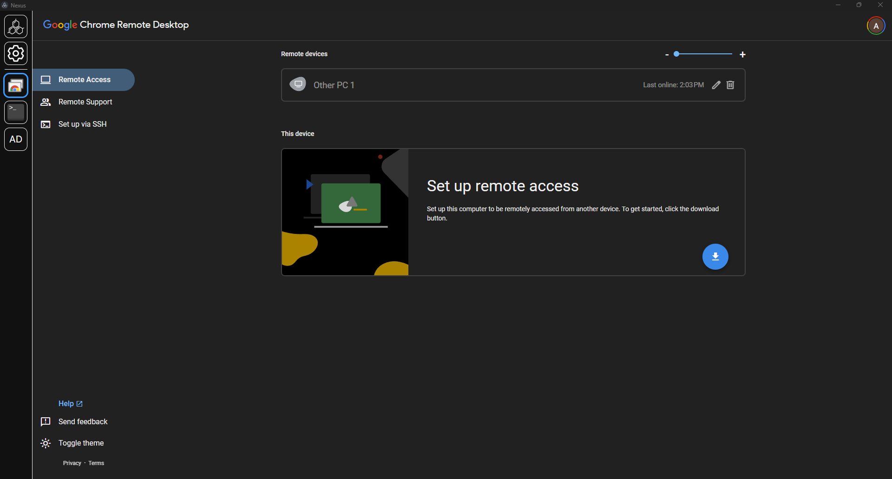
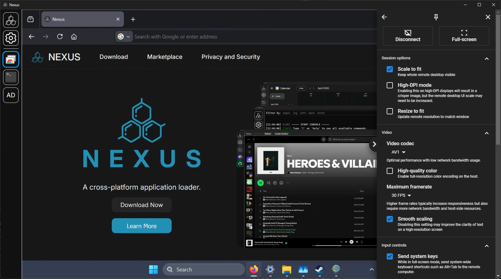

# Chrome Remote Desktop Standalone Application(ish)
This is a module for Nexus to use Chrome Remote Desktop as a desktop application instead of having to use a web browser.

# Installation
## Automatic Installation (Recommended)
1. Install the latest release of Nexus at :
   - https://www.nexus-app.net/ or 
   - https://github.com/aarontburn/nexus-core/releases/latest
2. Visit the Chrome Remote Desktop module marketplace page and press "Install to Nexus"
3. When prompted, restart Nexus.

## Manual Installation
1. Install the latest release of Nexus at https://www.nexus-app.net/ or https://github.com/aarontburn/nexus-core/releases/latest
2. Download the latest release of the Chrome Remote Desktop module at https://github.com/aarontburn/nexus-chrome-remote-desktop/releases/latest
3. Keep the release as a `.zip`.
4. Open Nexus and navigate to the settings and press "+ Import Module"
5. Select the downloaded `.zip`
6. When prompted, restart Nexus

# Screenshots

